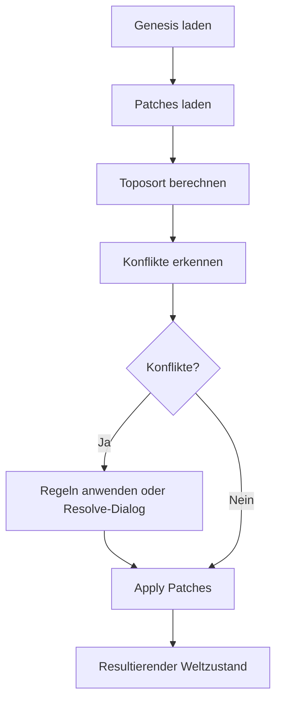
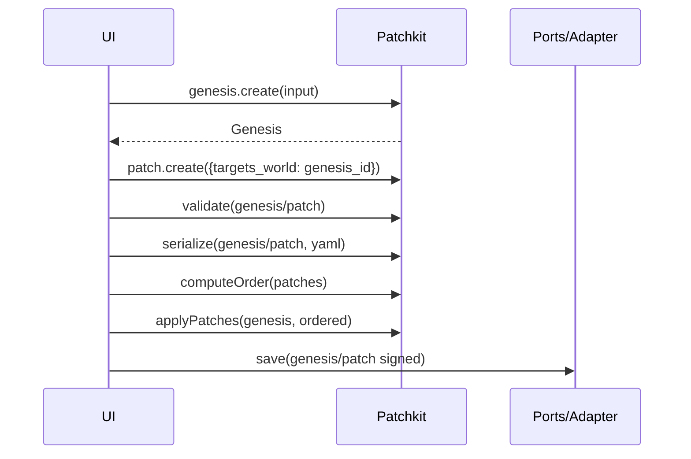

# @iakw/patchkit — Überblick und Gesamtkonzept

Ziele
- Konsistenz: Einheitliche Erzeugung, Validierung, Anwendung und Serialisierung von Genesis und Patches im Hauptspiel und im Preset-Editor.
- Single Source of Truth: Eine gemeinsame, versionierte Bibliothek kapselt Parsing, Validierung, Reihenfolge, Diff/Merge, Serialisierung und Signaturprüfungen.
- Wiederverwendbarkeit: Reine, komposable API mit klaren Datentypen und deterministischen Ergebnissen; I/O via Ports injizierbar.
- Testbarkeit: Pure-Function-Prinzipien, deterministische Seeds, stabile Snapshots, Mocks für I/O.

Kernkonzepte
- Genesis: Ausgangswelt mit Metadaten, initialen Entities und optionalen Regeln. Persistenz als Nostr kind 30311 (d=genesis_id) oder Dateien.
- Patches: Deklarative Änderungen an einer Zielwelt targets_world (genesis_id), mit operationen add, update, delete sowie overrides. Persistenz als Nostr kind 30312 oder Dateien.
- Weltaufbau: Deterministischer Zustand aus Genesis + geordneter Patchmenge (Toposort mit Konflikt- und Policy-Regeln).

Architektur-Übersicht
- Public API: genesis.*, patch.*, world.*, io.*, errors.*, types.*
- Core-Module:
  - schema: JSON-Schemas (Ajv) + TS-Inferenz (Zod)
  - parsing: sichere YAML/JSON-Parser
  - order: Toposort, Policy/Tie-Breaker
  - merge-diff: strukturierte Diffs, 3-Wege-Merge
  - apply: Ausführung von Operationen auf WorldState
  - migrate: Upgrader zwischen Schema-Versionen
  - ids: eindeutige IDs, Base64URL, optionale Seeds
  - security: Signaturprüfung, Härtung
- I/O-Ports und Adapter:
  - Ports: GenesisPort, PatchPort, WorldPort, LoggerPort, SignerPort, VerifierPort
  - Adapter: Nostr, FS, HTTP, IndexedDB

Determinismus
- Gleiche Eingaben → gleicher Output, inklusive Reihenfolge, Konfliktbericht, Hashes.
- Injizierbare Clock und RNG für reproduzierbare Tests.

Governance und Konflikte
- Reihenfolge: depends_on → created_at → Policy (Trust/Whitelist).
- Konflikte: Update/Update, Delete/Update, Add/Add.
- Auflösung: Regeln (last-wins, priority), manuelle Dialoge (Accept A/B, Merge, Override Patch).

Mermaid: High-Level Flow
Hinweis: Keine doppelten Anführungszeichen in eckigen Klammern.

Mermaid: Editor-Interaktion

Sicherheitsprinzipien
- Eingabehärtung: YAML-Parser mit Tiefe- und Größenlimits.
- Signaturprüfung: author_npub muss mit pubkey übereinstimmen.
- Sichere Defaults und normalisierte Schlüssel.

Leistungsaspekte
- Toposort O(N+E), Anwendung linear in der Anzahl Operationen.
- Optionales Offloading in Web Worker/Worker Threads.

YAML-Handling und originalYaml-Feld
- Das `originalYaml`-Feld stellt sicher, dass der ursprüngliche YAML-Text beim Speichern und Laden erhalten bleibt
- Beim Speichern einer Genesis:
  - Der YAML-Content wird direkt als String im Event-Content gespeichert (kind 30311)
  - Das `originalYaml`-Feld wird auf den YAML-String gesetzt
- Beim Speichern eines Patches:
  - Der YAML-Content wird im `payload`-Feld des Patch-Events gespeichert (kind 30312)
  - Das `originalYaml`-Feld wird auf den YAML-String gesetzt
- Beim Laden:
  - Genesis: `originalYaml` = Event-Content (YAML-String)
  - Patch: `originalYaml` = payload (YAML-String)
- Der Editor verwendet `originalYaml` bevorzugt, um das ursprüngliche YAML-Format wiederherzustellen

Diese Implementierung stellt sicher, dass:
- Das ursprüngliche YAML-Format erhalten bleibt
- Keine Datenverlust beim Roundtrip (Speichern → Laden) auftritt
- Die Kompatibilität mit bestehenden YAML-Dateien gewahrt bleibt
- Die neue Architektur mit @iakw/patchkit vollständig unterstützt wird