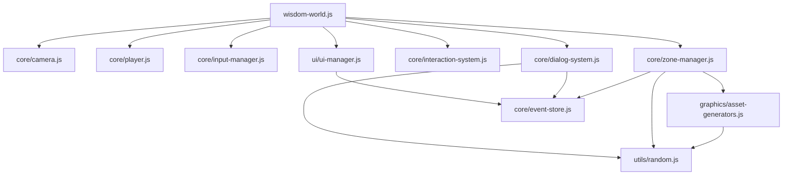

# Modulare Architektur der Wissens-Entdeckungswelt

Dieses Dokument beschreibt die vollständig refaktorierte, modulare Architektur der KI-gestützten Wissens-Entdeckungswelt. Die ursprünglich monolithische HTML-Datei wurde in eine saubere, erweiterbare Struktur aufgeteilt.

## 📁 Neue Dateistruktur

```
infinite-adventure-world-of-knowledge/
├── index.html                          # Haupteinstiegspunkt (vereinfacht)
├── client_ux_boilerplate.html          # Alternative HTML-Struktur
├── styles/
│   └── main.css                        # Komplette CSS-Styles mit Design-Tokens
├── js/
│   ├── utils/
│   │   └── random.js                   # Seeded Random-Utilities
│   ├── core/
│   │   ├── event-store.js              # Nostr-ähnlicher Event Store
│   │   ├── camera.js                   # Third-Person Kamera-System
│   │   ├── player.js                   # Spielerbewegung und Navigation
│   │   ├── input-manager.js            # Eingabeverwaltung (Tastatur/Maus)
│   │   ├── zone-manager.js             # Zonengenerierung und -verwaltung
│   │   ├── interaction-system.js       # Objektinteraktion und Raycast
│   │   └── dialog-system.js            # NPC-Dialog und Konversation
│   ├── graphics/
│   │   └── asset-generators.js         # Prozedurale Asset-Generierung
│   ├── ui/
│   │   └── ui-manager.js               # DOM-Manipulation und UI-Updates
│   └── wisdom-world.js                 # Hauptanwendung und Orchestrierung
└── docs/
    ├── modular-architecture.md         # Diese Datei
    └── ... (weitere Dokumentation)
```

## 🏗️ Architektur-Überblick

Die Anwendung folgt einem **modularen, komponentenbasierten Design** mit klarer Trennung der Verantwortlichkeiten:

### Kern-Prinzipien
- **Separation of Concerns**: Jedes Modul hat eine spezifische Aufgabe
- **Dependency Injection**: Module erhalten ihre Abhängigkeiten von außen
- **Event-driven Communication**: Lose Kopplung über Callbacks
- **ES6 Modules**: Native Browser-Module für saubere Imports

## 📦 Modul-Beschreibungen

### 🎯 **index.html** - Einstiegspunkt
**Zweck**: Vereinfachte HTML-Struktur ohne eingebetteten Code
```html
<!-- Minimaler Setup mit externen Referenzen -->
<link rel="stylesheet" href="styles/main.css">
<script type="module">
  import { WisdomWorld } from './js/wisdom-world.js';
  const app = new WisdomWorld();
</script>
```

### 🎨 **styles/main.css** - Styling-System
**Zweck**: Komplette visuelle Gestaltung mit Design-Tokens
```css
/* CSS Custom Properties für Theming */
:root {
  --bg: #0b0f14;
  --surface: #1a2332;
  --accent: #6ee7ff;
  /* ... weitere Design-Tokens */
}
```
**Features:**
- CSS Custom Properties für konsistente Farbpalette
- Responsive Grid-Layout
- Modulare Komponenten-Styles
- Dark Theme optimiert

### 🔧 **js/utils/random.js** - Utility-Funktionen
**Zweck**: Seeded Random-Generierung für deterministische Inhalte
```javascript
export function seededRng(seedStr) { /* ... */ }
export function pick(rng, arr) { /* ... */ }
```
**Features:**
- Deterministische Zonengenerierung basierend auf IDs
- Konsistente Ergebnisse über Sessions hinweg
- Utility-Funktionen für Array-Auswahl

### 🏛️ **js/core/** - Kern-Systeme

#### **event-store.js** - Daten-Persistierung
**Zweck**: Nostr-ähnlicher Event Store für persistente Spuren
```javascript
export const worldStore = {
  add(evt) { /* localStorage persistence */ },
  byKind(kind) { /* Event filtering */ }
};
export const EVENT_KINDS = { ZONE: 30001, PERSONA: 30002 /* ... */ };
```

#### **camera.js** - Kamera-System
**Zweck**: Third-Person Kamera mit Maus- und Tastatursteuerung
```javascript
export class ThirdPersonCamera {
  addMouseRotation(deltaX, deltaY) { /* Mauseingabe */ }
  addKeyboardRotation(deltaYaw) { /* Tastatureingabe */ }
  update() { /* Kamera-Position berechnen */ }
}
```
**Features:**
- Flüssige Third-Person Perspektive
- Kombinierte Maus/Tastatur-Steuerung
- Keine Kamera-Sprünge beim Loslassen der Maus

#### **player.js** - Spieler-Navigation
**Zweck**: WASD-Bewegung und Kollisionserkennung
```javascript
export class Player {
  move(dt, keys, isRightMouseDown, yaw, onRotationChange) {
    // Bewegung relativ zur Kamera-Ausrichtung
  }
}
```

#### **input-manager.js** - Eingabeverwaltung
**Zweck**: Unified Input-Handling mit Chat-Isolation
```javascript
export class InputManager {
  setMouseMoveCallback(callback) { /* Mausbewegung */ }
  isTypingInChat() { /* Chat-Input-Detection */ }
}
```

#### **zone-manager.js** - Welt-Generierung
**Zweck**: Prozedurale 3D-Zonen mit Personas und Portalen
```javascript
export class ZoneManager {
  generateZone(zoneId, personaHint) { /* 3D-Welt erstellen */ }
  updateAnimations(dt, clock, isObjectInRange, camera) { /* Animationen */ }
}
```

#### **interaction-system.js** - Objekt-Interaktion
**Zweck**: Raycast-basierte Interaktion mit Entfernungscheck
```javascript
export class InteractionSystem {
  interact() { /* E-Taste Interaktion */ }
  interactWithMouse(event) { /* Maus-Klick Interaktion */ }
}
```

#### **dialog-system.js** - Konversationen
**Zweck**: NPC-Dialoge und Quest-Generierung
```javascript
export class DialogSystem {
  openDialog(npc) { /* Chat öffnen */ }
  handleUserMessage(text, ...) { /* Nachricht verarbeiten */ }
}
```

### 🎨 **js/graphics/asset-generators.js** - Asset-Erstellung
**Zweck**: Prozedurale Generierung aller visuellen Assets
```javascript
export function makeSkyboxTextures(rng) { /* 6-seitige Skybox */ }
export function makePersonaTexture(name, role, rng) { /* Avatar-Billboards */ }
export function makePortalMaterial() { /* Animierte Portal-Materialien */ }
```

### 🖥️ **js/ui/ui-manager.js** - Interface-Management
**Zweck**: DOM-Manipulation und UI-Updates
```javascript
export class UIManager {
  refreshZonesUI() { /* Zonen-Liste aktualisieren */ }
  appendLog(line) { /* Event-Log erweitern */ }
  withLoading(fn) { /* Loading-Animation */ }
}
```

### 🌍 **js/wisdom-world.js** - Haupt-Orchestrator
**Zweck**: System-Integration und Anwendungslogik
```javascript
export class WisdomWorld {
  constructor() {
    this.setupThreeJS();
    this.setupConnections();
    this.setupRenderLoop();
  }
}
```

## 🔗 Modul-Abhängigkeiten



## 🚀 Vorteile der modularen Architektur

### ✅ **Wartbarkeit**
- **Isolierte Bugfixes**: Fehler können in spezifischen Modulen behoben werden
- **Klare Verantwortlichkeiten**: Jede Datei hat einen klar definierten Zweck
- **Reduzierte Komplexität**: Kleinere, verständlichere Code-Einheiten

### ✅ **Erweiterbarkeit**
- **Plugin-System**: Neue Features als separate Module hinzufügbar
- **API-Konsistenz**: Saubere Schnittstellen zwischen Komponenten
- **Konfigurierbarkeit**: Module können unabhängig angepasst werden

### ✅ **Testbarkeit**
- **Unit-Testing**: Einzelne Module isoliert testbar
- **Mock-Injection**: Abhängigkeiten können für Tests ersetzt werden
- **Behavior-Testing**: Klare Eingabe-/Ausgabe-Definitionen

### ✅ **Wiederverwendbarkeit**
- **Utility-Module**: Random-Generatoren in anderen Projekten nutzbar
- **System-Module**: Kamera-System als Basis für andere 3D-Anwendungen
- **Asset-Generatoren**: Prozedurale Texturen universell einsetzbar

## 🛠️ Entwicklungs-Workflows

### Neues Feature hinzufügen
1. **Modul erstellen**: Neue Datei in entsprechendem Ordner
2. **API definieren**: Export-Funktionen/Klassen spezifizieren
3. **Integration**: In `wisdom-world.js` einbinden
4. **Testing**: Isolierte Tests für neue Funktionalität

### Bestehende Funktion erweitern
1. **Modul lokalisieren**: Entsprechende Datei identifizieren
2. **API erweitern**: Neue Methoden/Properties hinzufügen
3. **Abhängigkeiten prüfen**: Auswirkungen auf andere Module bewerten
4. **Integration testen**: Gesamtfunktionalität validieren

### Performance optimieren
1. **Profiling**: Problematische Module identifizieren
2. **Isolierte Optimierung**: Spezifische Algorithmen verbessern
3. **Lazy Loading**: Module bei Bedarf laden
4. **Caching**: Berechnete Werte zwischen Modulen teilen

## 🔮 Zukunftserweiterungen

Die modulare Architektur ermöglicht einfache Integration von:

- **Multiplayer-System**: WebRTC/WebSocket-Module für Netzwerk-Kommunikation
- **Audio-System**: 3D-Spatial-Audio für immersive Erfahrung
- **Physics-Engine**: Realistische Physik-Simulation
- **VR/AR-Support**: Extended Reality Interfaces
- **Cloud-Synchronisation**: Persistent Storage in der Cloud
- **Plugin-Marketplace**: Community-Erweiterungen
- **Visual Scripting**: No-Code Editoren für Content-Erstellung

## 📝 Best Practices

### Modul-Design
- **Single Responsibility**: Ein Modul, eine Aufgabe
- **Kleine Interfaces**: Minimale, fokussierte APIs
- **Immutable Exports**: Konstante Export-Objekte
- **Error Handling**: Robuste Fehlerbehandlung in jedem Modul

### Code-Organisation
- **Konsistente Namensgebung**: `kebab-case` für Dateien, `PascalCase` für Klassen
- **Dokumentierte APIs**: JSDoc-Kommentare für alle Exports
- **Versionierung**: Semantic Versioning für Breaking Changes
- **Dependencies**: Minimale und explizite Abhängigkeiten

Die modulare Architektur transformiert das ursprüngliche monolithische System in eine wartbare, erweiterbare und professionelle Codebasis, die als Fundament für zukünftige Entwicklungen dient.
