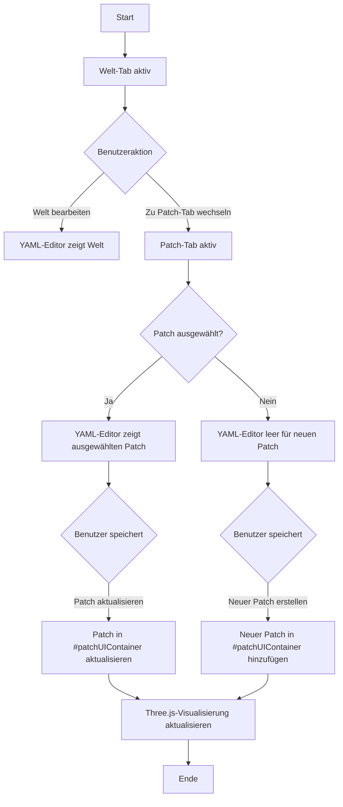

# Plan für die Implementierung eines Tab-Systems für Welt- und Patch-Bearbeitung

## Zusammenfassung
Basierend auf der Analyse der aktuellen Implementierung und den Anforderungen des Benutzers wird ein Tab-System für die Welt- und Patch-Bearbeitung implementiert. Der Benutzer soll zwischen zwei Tabs wechseln können: "Welt: [Name]" und "Patch: [Name]". Im Patch-Tab können neue Patches erstellt oder vorhandene Patches bearbeitet werden. Der #patchUIContainer wird für die Verwaltung der Patches verwendet.

## Architektur-Überblick

### 1. Tab-System für den YAML-Editor
- Implementierung eines Tab-Systems im linken Panel des world-editor.html
- Zwei Tabs: "Welt" und "Patch"
- Der Welt-Tab zeigt die aktuelle Welt im YAML-Editor an
- Der Patch-Tab zeigt den ausgewählten Patch im YAML-Editor an

### 2. Integration mit dem #patchUIContainer
- Der #patchUIContainer wird sichtbar gemacht und korrekt positioniert
- Integration mit dem Patch-Tab für die Auswahl und Bearbeitung von Patches
- Automatische Aktualisierung des Patch-Tabs bei Auswahl eines Patches im #patchUIContainer

### 3. Patch-Erstellungs-Workflow
- Wenn kein Patch ausgewählt ist und der Benutzer im Patch-Tab YAML-Code eingibt und speichert, wird automatisch ein neuer Patch erstellt
- Wenn ein Patch ausgewählt ist, wird dieser bearbeitet (überschrieben)
- Löschen von Patches über den #patchUIContainer

### 4. Integration mit der Three.js-Visualisierung
- Die Patch-Visualisierung wird mit dem neuen Tab-System integriert
- Die Visualisierung zeigt die Auswirkungen des aktuellen Patches auf die Welt an

## Detaillierte Implementierungsschritte

### Schritt 1: HTML-Struktur erweitern
1. Tab-Navigation im linken Panel hinzufügen
2. Tab-Inhaltsbereiche erstellen
3. Sicherstellen, dass der #patchUIContainer sichtbar ist

### Schritt 2: CSS-Styling anpassen
1. Tab-Styling implementieren
2. Sichtbarkeit des #patchUIContainer optimieren
3. Responsive Design für das Tab-System sicherstellen

### Schritt 3: JavaScript-Funktionalität implementieren
1. Tab-Wechsel-Funktionalität im preset-editor.js
2. Integration mit dem patch-ui.js für die Patch-Verwaltung
3. Patch-Erstellungs-Workflow implementieren

### Schritt 4: Integration mit der Three.js-Visualisierung
1. Anpassung der Patch-Visualisierung an das neue Tab-System
2. Sicherstellen, dass die Visualisierung korrekt aktualisiert wird

## Mermaid-Diagramm



## Benutzeroberflächen-Design

### Tab-System
- Zwei Tabs: "Welt: [Weltname]" und "Patch: [Patchname oder 'Neuer Patch']"
- Aktiver Tab wird hervorgehoben
- Tabs sind anklickbar zum Wechseln

### YAML-Editor
- Zeigt den Inhalt des aktiven Tabs an
- Im Welt-Tab: Die aktuelle Welt im YAML-Format
- Im Patch-Tab: Der ausgewählte Patch oder leer für einen neuen Patch

### #patchUIContainer
- Wird unter dem rechten Panel angezeigt
- Enthält Liste der verfügbaren Patches
- Ermöglicht Auswahl, Bearbeitung und Löschung von Patches
- Integration mit dem Patch-Tab des Editors

### Speicher-Buttons
- "Speichern (Genesis)": Speichert die Welt (nur im Welt-Tab sichtbar)
- "Speichern (Patch)": Speichert den Patch (nur im Patch-Tab sichtbar)

## Technische Umsetzungsdetails

### HTML-Änderungen
1. Tab-Navigation im linken Panel:
```html
<div class="tab-navigation">
  <button class="tab-button active" data-tab="world">Welt: <span id="worldName">Unbenannt</span></button>
  <button class="tab-button" data-tab="patch">Patch: <span id="patchName">Neuer Patch</span></button>
</div>
```

2. Tab-Inhaltsbereiche:
```html
<div class="tab-content active" id="world-tab">
  <textarea class="yaml-editor" id="world-yaml-editor" placeholder="# Deine YAML-Welt hier eingeben..."></textarea>
</div>
<div class="tab-content" id="patch-tab">
  <textarea class="yaml-editor" id="patch-yaml-editor" placeholder="# Deinen YAML-Patch hier eingeben..."></textarea>
</div>
```

### CSS-Änderungen
1. Tab-Styling:
```css
.tab-navigation {
  display: flex;
  border-bottom: 1px solid #3e3e42;
  margin-bottom: 10px;
}

.tab-button {
  background: #2d2d30;
  border: none;
  color: #d4d4d4;
  padding: 10px 15px;
  cursor: pointer;
  border-bottom: 2px solid transparent;
}

.tab-button.active {
  border-bottom-color: #4fc3f7;
  color: #4fc3f7;
}

.tab-content {
  display: none;
  height: 100%;
}

.tab-content.active {
  display: flex;
  flex-direction: column;
}
```

2. #patchUIContainer sichtbar machen:
```css
#patchUIContainer {
  display: grid;
  grid-template-columns: 340px 1fr;
  gap: 12px;
  padding: 10px;
  background: #f5f6f7;
  border-top: 1px solid #e5e7eb;
  color: #111827;
  height: 300px;
  overflow-y: auto;
}
```

### JavaScript-Änderungen
1. Tab-Wechsel-Funktionalität:
```javascript
// Tab-Wechsel-Event-Listener
document.querySelectorAll('.tab-button').forEach(button => {
  button.addEventListener('click', () => {
    const tabName = button.dataset.tab;
    
    // Aktiven Tab aktualisieren
    document.querySelectorAll('.tab-button').forEach(b => b.classList.remove('active'));
    document.querySelectorAll('.tab-content').forEach(c => c.classList.remove('active'));
    
    button.classList.add('active');
    document.getElementById(`${tabName}-tab`).classList.add('active');
    
    // Speicher-Buttons aktualisieren
    document.getElementById('saveGenesisBtn').style.display = tabName === 'world' ? 'inline-block' : 'none';
    document.getElementById('savePatchBtn').style.display = tabName === 'patch' ? 'inline-block' : 'none';
    
    // Patch-Visualisierung aktualisieren
    if (tabName === 'patch') {
      this._updatePatchVisualization();
    }
  });
});
```

2. Patch-Erstellungs-Workflow:
```javascript
// Patch-Speicher-Logik
async _savePatch() {
  const patchYaml = document.getElementById('patch-yaml-editor').value;
  const patchData = jsyaml.load(patchYaml);
  
  if (!this.currentPatch) {
    // Neuen Patch erstellen
    const newPatch = {
      id: 'patch_' + Math.random().toString(36).slice(2, 10),
      name: patchData.metadata?.name || 'Neuer Patch',
      data: patchData
    };
    
    this.patches.push(newPatch);
    this.currentPatch = newPatch;
    
    // Patch-UI aktualisieren
    this.patchUI.addPatch(newPatch);
  } else {
    // Vorhandenen Patch aktualisieren
    this.currentPatch.data = patchData;
    this.patchUI.updatePatch(this.currentPatch);
  }
  
  // Patch-Namen im Tab aktualisieren
  document.getElementById('patchName').textContent = this.currentPatch.name;
  
  // Three.js-Visualisierung aktualisieren
  this._updatePatchVisualization();
}
```

## Testplan

### 1. Tab-Wechsel testen
- Wechsel zwischen Welt- und Patch-Tab
- Sicherstellen, dass der richtige Inhalt angezeigt wird
- Überprüfen, dass die richtigen Speicher-Buttons sichtbar sind

### 2. Patch-Erstellung testen
- Im Patch-Tab YAML-Code eingeben
- Speichern und überprüfen, dass ein neuer Patch erstellt wird
- Überprüfen, dass der Patch im #patchUIContainer erscheint

### 3. Patch-Bearbeitung testen
- Patch im #patchUIContainer auswählen
- YAML-Code im Patch-Tab bearbeiten
- Speichern und überprüfen, dass der Patch aktualisiert wird

### 4. Patch-Löschung testen
- Patch im #patchUIContainer auswählen
- Löschen und überprüfen, dass der Patch entfernt wird
- Überprüfen, dass der Patch-Tab zurückgesetzt wird

### 5. Three.js-Visualisierung testen
- Überprüfen, dass die Visualisierung bei Patch-Auswahl aktualisiert wird
- Sicherstellen, dass die Patch-Änderungen korrekt visualisiert werden

## Zusammenfassung der nächsten Schritte

1. Implementierung des Tab-Systems in der HTML-Struktur
2. Anpassung des CSS-Stylings für Tabs und den #patchUIContainer
3. Implementierung der JavaScript-Funktionalität für Tab-Wechsel und Patch-Verwaltung
4. Integration mit der Three.js-Visualisierung
5. Testen der gesamten Funktionalität

Dieser Plan stellt sicher, dass der Benutzer einen intuitiven Workflow für die Erstellung und Bearbeitung von Patches hat, mit klarer Trennung zwischen Welt- und Patch-Bearbeitung.